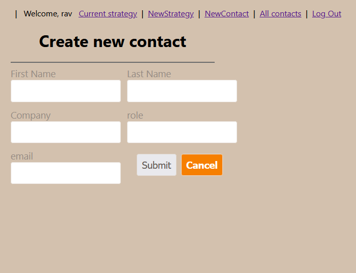
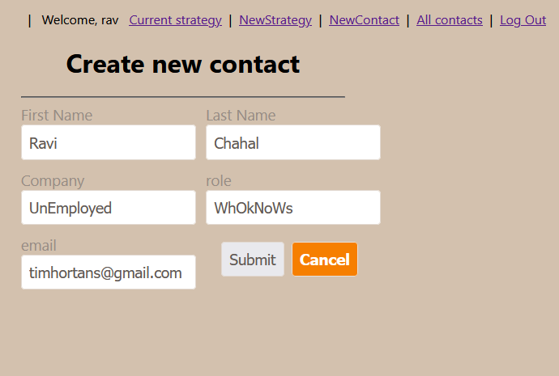

Include the following sections within the README.md:

☐ App Title: 
☐ NetWORKER A MERN full stack app

☐ Technologies Used: 
   - MongoDB & Mongoose
   - Express
   - ReactJS
   - Node
   - React Bootstrap
   - Git & GitHub
   - Axios

☐ Getting Started: That Includes:

  
 
 
 
 
 
 
 [Trello Bord](https://trello.com/b/y9s0YG4m/project-4)

☐ Next Steps: Planned future enhancements (icebox items).

- Link to LinkedIn API

- Link to Google Calender for more itegration

- More feature for notes/forum, for users to share ideas
